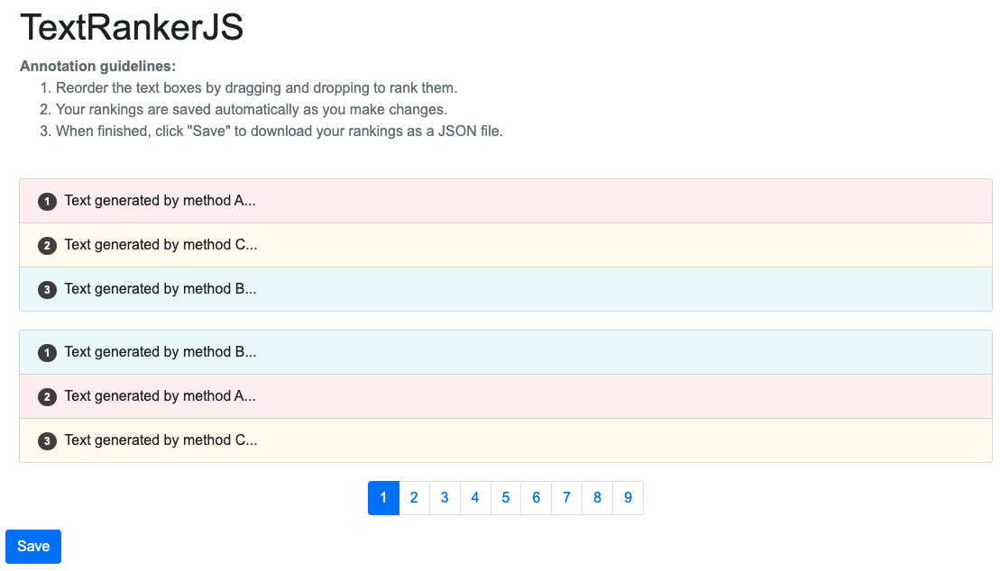

# TextRankerJS

TextRankerJS is a fully client-side JavaScript tool for ranking texts generated by different methods. Designed for human annotation studies, it offers an intuitive drag-and-drop interface, pagination, and local storage for data persistence. Leverage TextRankerJS to streamline your text ranking tasks with ease.

## Features

- Fully client-side JavaScript implementation
- Intuitive drag-and-drop interface for ranking texts
- Supports multiple text generation methods
- Pagination for easy navigation through examples
- Local storage to save rankings between sessions
- Export rankings to a JSON file


## Demo

Try out the TextRankerJS demo here: https://mtreviso.github.io/TextRankerJS/.




## How to Use

To customize TextRankerJS for your specific use case, follow these steps:

1. **Add or modify examples**: Add new examples or modify existing ones in the `js/examples.js` file. Each example should be an object with keys representing different methods and the texts generated by these methods as their values. Optionally, you can include a "reference" key with the reference text. For example:

```javascript
const examples = [
    {
        "reference": "Text generated by a human...",
        "methodA": "Text generated by method A...",
        "methodB": "Text generated by method B...",
        "methodC": "Text generated by method C..."
    },
    ...
];
```

2. **Change the page size**: To change the number of examples displayed per page, modify the `pageSize` variable in the `js/main.js` file (default: `pageSize = 10`).


3. **Choose between draggable and inputable interfaces**: You can select either a draggable interface (drag and drop to reorder) or an inputable interface (input numbers to set the ranking). To change the interface, set the `useDraggableInterface` variable in the `js/main.js` file to `true` for the draggable interface or `false` for the inputable interface.

4. **Shuffle or maintain the order of methods**: To shuffle the methods before rendering, set the `shuffleMethods` variable in the `js/main.js` file to `true`. If you want to maintain the original order of methods as they appear in the examples, set the variable to `false`.

5. **Control background colors**: Set the `colorizeBoxes` variable in the `js/main.js` file to `true` to enable background colors for each box or `false` to disable them. You can further customize the background colors by changing the `colorizePerMethod` variable to `true` (one color per method) or `false` (one color per ranking position).

6. **Show or hide reference texts**: To show or hide reference texts in the examples, set the `showReferences` variable in the `js/main.js` file to `true` (show) or `false` (hide).

7. **Show or hide the gold label**: To toggle the display of gold labels for references, set the `showGoldLabels` flag in the `js/main.js` file to `true` (show) or `false` (hide).


## License

TextRankerJS is released under the [MIT License](LICENSE).
